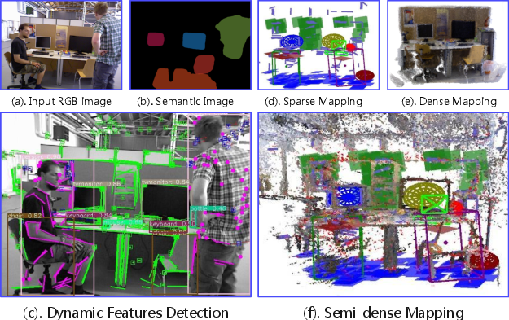
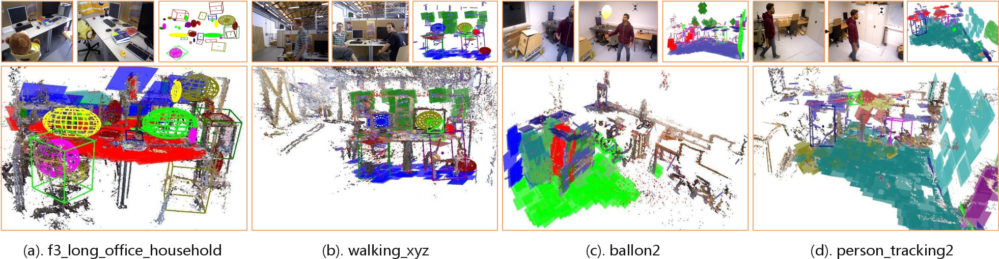

# SLAM^2: Simultaneous Localization and Multi-mode Mapping for Indoor Dynamic Environments

This project is an extended version of ORB-SLAM3, incorporating additional features and modifications.




The system inputs include RGB-D images and plane semantic images. 


## Prerequisites

Ensure you have the following dependencies installed:

- CMake (version 2.9 or higher)
- OpenCV (version 3.4.1)
- Eigen3
- Pangolin
- Torch (LibTorch)
- OpenMP
- CGAL
- Boost
- LAPACK
- BLAS

## Building the Project

1. Clone this repository:

```
2. Create a build directory and navigate into it:
```

mkdir build cd build

```
3. Run CMake:
```

cmake ..

4. Build the project:

make -j4

## Features

This version includes:

- Integration with YOLO v5 for object detection
- Line feature extraction and matching
- Probabilistic mapping
- 3D object detection and modeling
- Planar mapping module
- Integration with GCRANSAC for robust estimation

## Datasets Prepare

The datasets should include:

depth mask rgb and their associations, like 1548266469.886330 rgb/1548266469.88633.png 1548266469.882170 depth/1548266469.88217.png 1548266469.886330 mask/1548266469.88633.png. The mask images can be generated by PlaneRecNet.

The weight folder should contain the trained YOLO model file and the category labels of the coco dataset.


## Examples

The project includes several example executables:

- RGB-D: `rgbd_tum`

 To run an example, use:

./Examples/<category>/<executable_name>





## License

[Include license information here]

## Acknowledgments

This project is based on ORB-SLAM3 and incorporates various third-party libraries. We acknowledge the contributions of the original authors and the open-source community.

